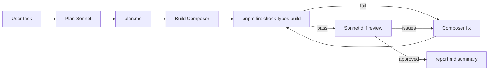

# Agentic harness (skill-only)

Run **plan → build → verify** inside Cursor. No CLI package—this skill is the orchestrator. The **parent agent** (you) drives phases using **Task** subagents, shell commands, and optional artifacts under `.harness/`.

## Models

| Phase  | Model                      | Subagent type                 |
| ------ | -------------------------- | ----------------------------- |
| Plan   | `claude-sonnet-5-5-medium` | `generalPurpose` or Plan mode |
| Build  | `composer-2.5`             | `generalPurpose`              |
| Review | `claude-sonnet-5-5-medium` | `generalPurpose`              |

User may override models; default to the table above.

## Run ID and artifacts

At start, pick a run id: ISO timestamp safe for paths (e.g. `2026-10-02T18-00-00`).

Create `.harness/<runId>/` and write:

- `plan.md` — output of plan phase
- `report.md` — append status after each phase and at end

`.harness/` is gitignored.

## Workflow



### 0. Intake

- Restate the user task in one sentence.
- Ask for `--plan-only` equivalent if they only want a plan (stop after phase 1).
- Default **max fix iterations**: 3 (command failures or review rejections each count as one iteration toward the same cap).

### 1. Plan (Sonnet 5.5)

**Goal:** Read-only exploration; produce an actionable plan. No product code edits.

Options (pick one):

- **Recommended:** Spawn a Task subagent with `model: claude-sonnet-5-5-medium`, thoroughness `medium`, prompt: explore repo, write plan to `.harness/<runId>/plan.md`, include files to touch, steps, and how to verify. Do not implement.
- **Alternative:** Switch to **Plan** mode yourself, produce the plan, save to `.harness/<runId>/plan.md`.

**Gate:** `plan.md` must be non-empty and match the user task. If plan-only, write `report.md` and summarize for the user—**stop**.

### 2. Build (Composer)

Spawn a **single** Task subagent with `model: composer-2.5` (or implement inline if user asked you to build directly—prefer subagent for isolation).

Prompt must include:

- Full text of `plan.md` (or path + instruct read)
- Minimal diff; match repo conventions
- Do not edit `.harness/` except if the plan requires it

For fix iterations, **same thread is not available across Tasks**—each fix is a new Task with: original plan + `git diff` summary + failure logs or review JSON issues.

### 3. Verify (commands)

From repo root, run sequentially; stop on first failure:

```bash
pnpm lint
pnpm check-types
pnpm build
```

Capture output for fix prompts. On failure, if iterations remain, go to **Build fix** with command output; else write `report.md` and tell the user verification failed.

Skip diff review if the user asked for commands-only verification.

### 4. Review (Sonnet 5.5)

Spawn Task with `model: claude-sonnet-5-5-medium`, **read-only** (`tools` limited to read/grep if needed).

Provide:

- Full `plan.md`
- `git diff` (staged + unstaged)

Ask for **JSON only**:

```json
{ "approved": true, "issues": [] }
```

Parse `approved` and `issues`. If not approved and iterations remain, **Build fix** with issues list; else fail with report.

### 5. Done

Write `report.md`: task, models used, iterations, command results, review verdict, changed areas.

Summarize for the user: approved vs failed, key files, next steps.

## Fix prompt template (Composer Task)

```text
Implement fixes only. Original plan:
<plan.md contents>

Verification failed:
<command output OR review issues as bullets>

Keep scope minimal; do not change unrelated files.
```

## Principles

- Minimize scope; one plan, one build stream per iteration.
- Do not commit unless the user asks.
- Plan phase must not ship feature code.
- Prefer subagents for plan/build/review so models match the table.

## When the user says "run harness"

1. Read this skill and execute the workflow.
2. Do not reference `pnpm harness` or `@cursor/sdk`—they are not part of this repo.
